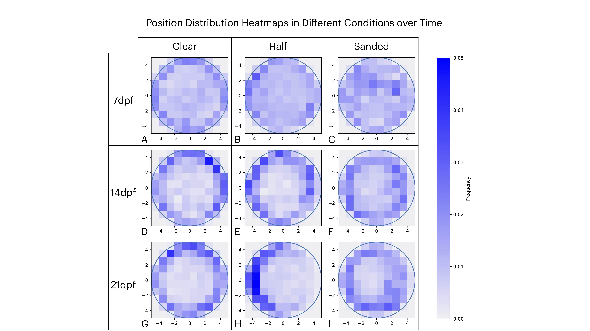

Text can be **bold**, _italic_, or ~~strikethrough~~.

[Link to another page](./another-page.html).

There should be whitespace between paragraphs.

There should be whitespace between paragraphs. We recommend including a README, or a file with information about your project.

# Abstract

Larval zebrafish integrate hydrodynamic and visual cues to navigate their environment, yet the developmental onset and mechanistic role of vision in shaping spatial exploration remain poorly understood. Here, we combine quantitative behavioral experimentation with computational modeling to understand how visual feedback influences boundary interactions in zebrafish larvae. We recorded individual trajectories of wild-type larvae in circular Petri dish arenas under different boundary conditions at various points in development. Using idtracker.ai for high-precision tracking, we transformed positions and velocities into radial and angular distributions. We employed kernel-smoothed two-sample Kolmogorov–Smirnov tests to detect shifts in spatial occupancy over development.

At 7 days post-fertilization (dpf), larvae exhibited uniform distributions across all arena types. By 14dpf, wild-type fish in clear arenas showed a significant migration toward the perimeter, an effect that intensified by 21dpf, where fish circled the boundary in sustained patterns. In half-sanded arenas, wild-type larvae developed strong symmetry-breaking, preferentially occupying the side where reflection was visible. In contrast, blind mutants maintained uniform distributions at all stages, indicating that visual input is necessary for boundary bias.

To examine underlying mechanisms, we extracted age-dependent speed distributions and implemented three simulation conditions: (1) a Brownian random walk model, (2) a probabilistic turning model featuring a tunable weight function over distance, and (3) a reflection-guided model using Snell’s law to sample turning directions toward perceived reflected light. The physics-based turning model accurately recapitulated edge preference in sanded arenas and the symmetry-breaking observed in half-sanded arenas, validating the hypothesis that vision-driven reflection sampling governs boundary navigation.

Our integrated pipeline combining controlled genetic and arena manipulations with rigorous statistical analysis and flexible computational models provides a framework for understanding sensorimotor integration in zebrafish and other small organisms. Through a simple, low-parameter model, we can recapitulate the various symmetry-breaking events that occur during the development of the zebrafish visual system. These findings explicate the developmental role of visual cues in spatial behavior and offer a modular platform for future studies linking neural circuitry to emergent movement patterns.

## Header 2



> This is a blockquote following a header.
>
> When something is important enough, you do it even if the odds are not in your favor.

### Header 3

```js
// Javascript code with syntax highlighting.
var fun = function lang(l) {
  dateformat.i18n = require('./lang/' + l)
  return true;
}
```

```ruby
# Ruby code with syntax highlighting
GitHubPages::Dependencies.gems.each do |gem, version|
  s.add_dependency(gem, "= #{version}")
end
```

#### Header 4

*   This is an unordered list following a header.
*   This is an unordered list following a header.
*   This is an unordered list following a header.

##### Header 5

1.  This is an ordered list following a header.
2.  This is an ordered list following a header.
3.  This is an ordered list following a header.

###### Header 6

| head1        | head two          | three |
|:-------------|:------------------|:------|
| ok           | good swedish fish | nice  |
| out of stock | good and plenty   | nice  |
| ok           | good `oreos`      | hmm   |
| ok           | good `zoute` drop | yumm  |

### There's a horizontal rule below this.

* * *

### Here is an unordered list:

*   Item foo
*   Item bar
*   Item baz
*   Item zip

### And an ordered list:

1.  Item one
1.  Item two
1.  Item three
1.  Item four

### And a nested list:

- level 1 item
  - level 2 item
  - level 2 item
    - level 3 item
    - level 3 item
- level 1 item
  - level 2 item
  - level 2 item
  - level 2 item
- level 1 item
  - level 2 item
  - level 2 item
- level 1 item

### Small image


### Large image


### Definition lists can be used with HTML syntax.

<dl>
<dt>Name</dt>
<dd>Godzilla</dd>
<dt>Born</dt>
<dd>1952</dd>
<dt>Birthplace</dt>
<dd>Japan</dd>
<dt>Color</dt>
<dd>Green</dd>
</dl>

```
Long, single-line code blocks should not wrap. They should horizontally scroll if they are too long. This line should be long enough to demonstrate this.
```

```
The final element.
```
