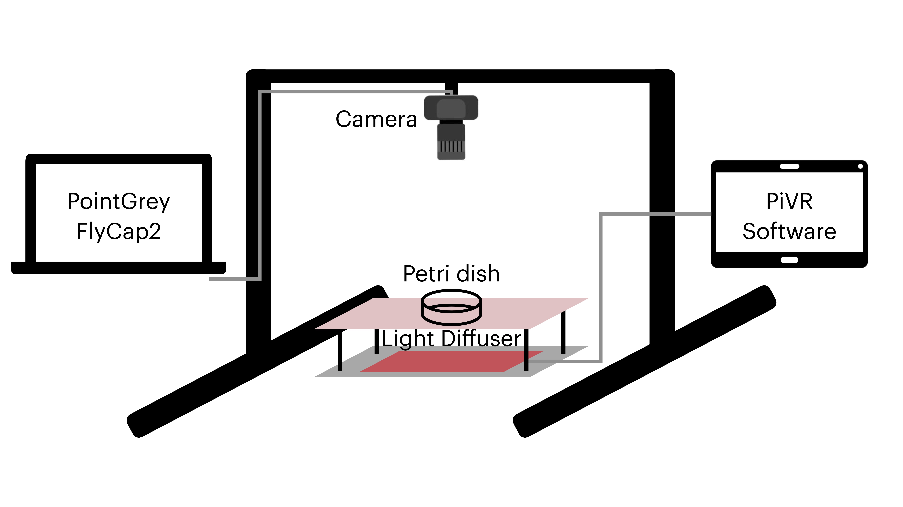
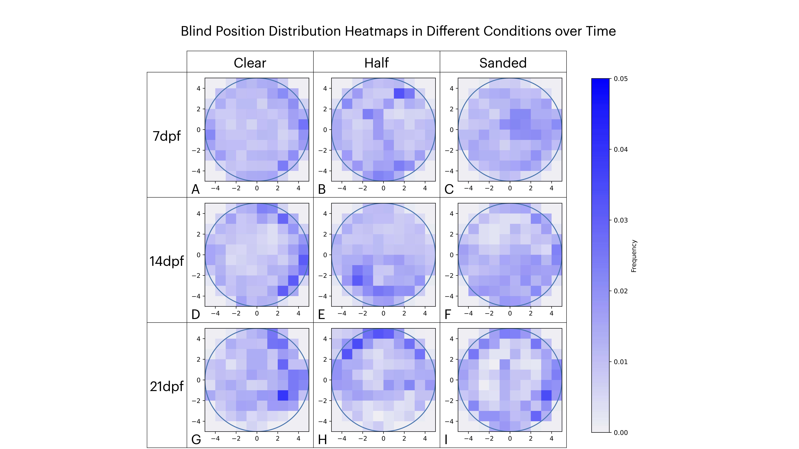
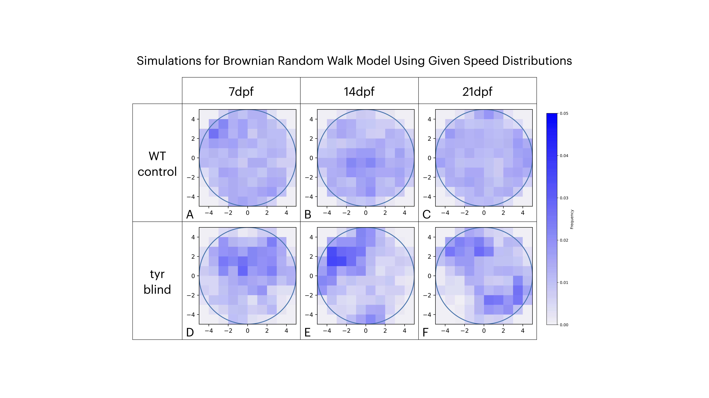
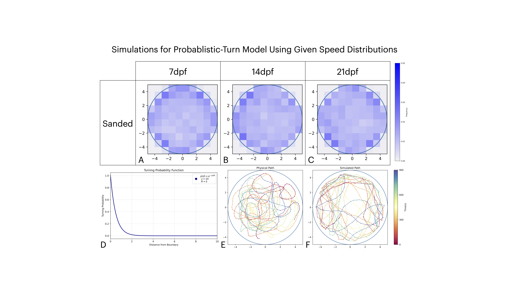
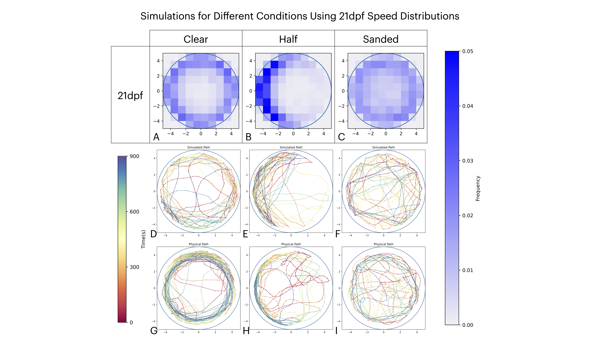

A computational and data-driven framework for modeling and analyzing larval zebrafish behavior, combining experimental observations with physics-based simulations to uncover how sensory inputs and environmental boundaries shape collective motion.

This repository is built on research involving both wild-type zebrafish and TYR mutant (vision-impaired) zebrafish, aiming to dissect the role of visual and hydrodynamic cues in locomotion and group dynamics. By bridging behavioral biology with active matter physics, the tools and models here offer a systematic approach to understanding how fish interact with their environment and with each other.

# Abstract

Larval zebrafish integrate hydrodynamic and visual cues to navigate their environment, yet the developmental onset and mechanistic role of vision in shaping spatial exploration remain poorly understood. Here, we combine quantitative behavioral experimentation with computational modeling to understand how visual feedback influences boundary interactions in zebrafish larvae. We recorded individual trajectories of wild-type larvae in circular Petri dish arenas under different boundary conditions at various points in development. Using idtracker.ai for high-precision tracking, we transformed positions and velocities into radial and angular distributions. We employed kernel-smoothed two-sample Kolmogorov–Smirnov tests to detect shifts in spatial occupancy over development.

At 7 days post-fertilization (dpf), larvae exhibited uniform distributions across all arena types. By 14dpf, wild-type fish in clear arenas showed a significant migration toward the perimeter, an effect that intensified by 21dpf, where fish circled the boundary in sustained patterns. In half-sanded arenas, wild-type larvae developed strong symmetry-breaking, preferentially occupying the side where reflection was visible. In contrast, blind mutants maintained uniform distributions at all stages, indicating that visual input is necessary for boundary bias.

To examine underlying mechanisms, we extracted age-dependent speed distributions and implemented three simulation conditions: (1) a Brownian random walk model, (2) a probabilistic turning model featuring a tunable weight function over distance, and (3) a reflection-guided model using Snell’s law to sample turning directions toward perceived reflected light. The physics-based turning model accurately recapitulated edge preference in sanded arenas and the symmetry-breaking observed in half-sanded arenas, validating the hypothesis that vision-driven reflection sampling governs boundary navigation.

Our integrated pipeline combining controlled genetic and arena manipulations with rigorous statistical analysis and flexible computational models provides a framework for understanding sensorimotor integration in zebrafish and other small organisms. Through a simple, low-parameter model, we can recapitulate the various symmetry-breaking events that occur during the development of the zebrafish visual system. These findings explicate the developmental role of visual cues in spatial behavior and offer a modular platform for future studies linking neural circuitry to emergent movement patterns.

# Results

> Our experimental setup consists of running the PiVR software through the
tablet to control the power of the red light emitted through the ceramic plates. We
placed a Petri dish on the top ceramic plate and recorded from above using a Teledyne
FLIR Grasshopper3 USB3 camera with a Zeiss Milvus 85mm f/1.4 lens. We connected
the camera setup to the PointGrey FlyCapture2 SDK, where AVI file-format videos
were recorded and saved onto a hard drive.

> From the iteratively tracked videos, we can plot the spatial distribution
of each condition (clear, sanded, and half-sanded) across various time points (7, 14,
and 21dpf). We sand the half-dish on the right half of the dish as represented by the
right half of all three plots (B, E, H). We scaled all plots to the same dimensions (10
bins by 10 bins) with a shared frequency color bar to label distribution intensity. For
the sanded dishes (C, F, I), there is no significant change in behavior. In contrast,
across the clear dishes (A, D, G), a shift towards the boundary occurs over time.
The behavior at 7dpf (A, B, C) is comparable across all three conditions. The main
conclusion of these results is evident in the half-sanded dish (B, E, H), where, by
21dpf, a clear symmetry breaking occurs, resulting in a strongly skewed distribution
away from the sanded side.

> From the iteratively tracked videos of CRISPR/Cas9 tyr-knockout ze-
brafish, we can make the same spatial distribution plots of each condition (clear,
sanded, and half-sanded) across various time points (7, 14, and 21dpf). Again, we
only sand the half-sanded dish on the right half of the dish, as reflected in all three
plots. In this case, there are no significant changes in behavior across all plots. The
sample size of this dataset is smaller, resulting in some random distribution; however,
there is no consistent behavior across the time points and different conditions.

> Given our experimental data, we extracted the speed distributions at
each time point for the control wild-type fish (A, B, C) and the tyr-knockout blind
fish (D, E, F). We use those speed distributions to produce heatmaps of the position
distributions from a Brownian random walk simulation. There is less symmetry due
to slower speeds from the tyr-knockout blind distributions, leading to more random
behavior across ten 900 timepoint iterations.

> We simulate our sanded dish using the speed distributions from the re-
spective experimental data at each time point. We then apply our turning probability
function, which has an exponential turning parameter of 10 (D), determining the like-
lihood of turning based on the straight distance to the boundary. Combining the
depicted function with normal movement and some noise level, we can produce simu-
lated paths of a single zebrafish (F). We can compare it with an arbitrary experimental
zebrafish (E) to see that our simulation produces development movement patterns,
albeit with sharper turns. From this, we take ten 900 timepoint observations for each
stage of development to again produce 2D spatial distribution heatmaps (A, B, C)
representing our simulated sanded dish.

> After simulating 10 iterations of 900 time points, we can produce the
equivalent two-dimensional heatmaps for each simulation condition (A, B, C). We also
include an arbitrary simulation of each condition, including the simulated zebrafish’s
path (D, E, F). Directly below, the bottom row includes a physical zebrafish swimming
path of a single fish (G, H, I). Overall, our simulated distributions accurately reflect the
overall behavior exhibited by the physical data, including both the symmetry-breaking
and preference for a clear boundary. Again, the individual paths reflect the physical
paths, but they are less smoothed out.

Download the full length senior thesis [here](Eric_Zhu_Senior_Thesis.pdf).
